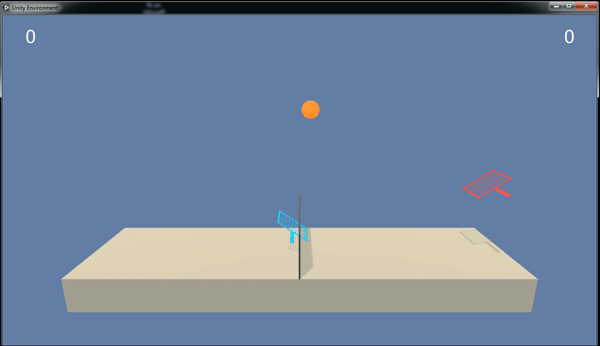

# DRLND_3nd_project_FINAL
The submission version of DRLND 3nd project (collaboration and competition) solved with DDPG.
 
## Environment

### 1) States
* Vector observation space size is 24
* State space is consisted with (racket position x, y, velocity x, y, ball position x, y, velocity x, y) for three time steps
   *hence 8x3 = 24*
   

### 2) Actions
* Action size is 2 (*go towards (or away from) net / jump*)

### 3) Reward
* Reward +0.1 is given for each time the ball goes over the net.
* The episode ends when the ball touches the net or goes out of the court.
* Environment is considered solved when the average reward for 100 episodes becomes larger than 0.5.
* Since there are two different rewards (for each agent), the max reward is considered to be the actual reward.

## Getting Started

### 1) Instruction for Installing Dependencies
* Open Anaconda prompt and type the following.
```
conda create --name drlnd ## python=3.6 
activate drlnd
```

* Under the drnld environment, follow the instructions below.
```
git clone https://github.com/udacity/deep-reinforcement-learning.git
cd deep-reinforcement-learning/python
pip install .  
```

* The **requirements.txt** within the python folder can be modified (in my experience).
```
tensorflow==1.7.1     ## I used 1.13.1
Pillow>=4.2.1
matplotlib
numpy>=1.11.0
jupyter
pytest>=3.2.2
docopt
pyyaml
protobuf==3.5.2
grpcio==1.11.0
torch==0.4.0        ## I used 1.0.1
pandas
scipy
ipykernel
```

* Install the drlnd environment.
```
python -m ipykernel install --user --name drlnd --display-name "drlnd"
```

* Make a jupyter notebook with **drlnd** environment. 
* Use the following code to import UnityEnvironment. (The *Tennis_Windows_x86_64* folder should be within the same directory.)
* The (random) tennis playing should be shown. 
```
from unityagents import UnityEnvironment
import numpy as np
env = UnityEnvironment(file_name="Tennis_Windows_x86_64/Tennis.exe")
# get the default brain
brain_name = env.brain_names[0]
brain = env.brains[brain_name]

for i in range(1, 60):                                      # play game for 5 episodes
    env_info = env.reset(train_mode=False)[brain_name]     # reset the environment    
    states = env_info.vector_observations                  # get the current state (for each agent)
    scores = np.zeros(num_agents)                          # initialize the score (for each agent)
    while True:
        actions = 0.3*np.random.randn(num_agents, action_size) # select an action (for each agent)
        actions = np.clip(actions, -1, 1)                  # all actions between -1 and 1
     
        env_info = env.step(actions)[brain_name]           # send all actions to tne environment
        next_states = env_info.vector_observations         # get next state (for each agent)
        rewards = env_info.rewards                         # get reward (for each agent)

        dones = env_info.local_done                        # see if episode finished
        scores += env_info.rewards                         # update the score (for each agent)
        states = next_states                               # roll over states to next time step
        if np.any(dones):                                  # exit loop if episode finished
            break
    print('Score (max over agents) from episode {}: {}'.format(i, np.max(scores)))
```

 
### 2) How to Run Code
* Run Jupyter notebook 'Tennis.ipynb' for both training and saving after problem is solved.

