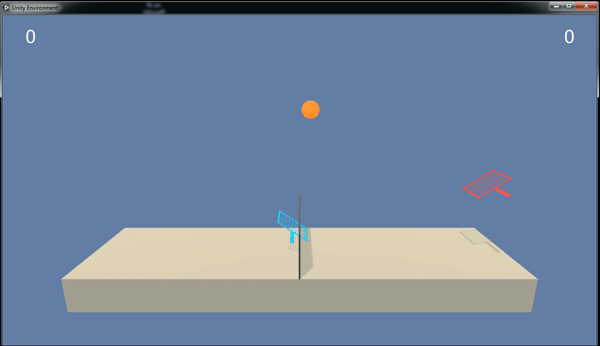

# DRLND_3nd_project_FINAL
The submission version of DRLND 2nd project (continuous control) solved with DDPG.

## Environment

### 1) States
* Vector observation space size is 33
### 2) Actions
* Action size is 4
### 3) Reward
* Reward +0.1 is given for each step the reacher has its end within the moving sphere.
* The max time step of one episode consists of 1000 steps.
* Environment is considered solved when the average reward for 100 episodes becomes larger than 30.

## Getting Started

### 1) Instruction for Installing Dependencies
* from unityagents import UnityEnvironment
* env = UnityEnvironment(file_name='/data/Reacher_Linux_NoVis/Reacher.x86_64')

### 2) How to Run Code
* Run Jupyter notebook 'Continuous_Control.ipynb' for both training and saving after problem is solved.
